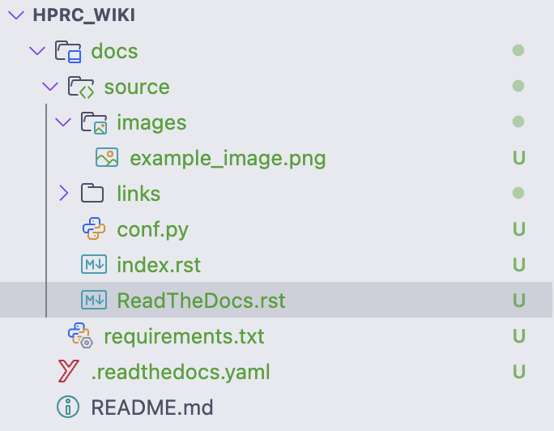

ReadTheDocs
===========

ReadTheDocs is simply a website that hosts documentation for projects. When you want do update documentation, you simply need to push your changes to the branch that
ReadTheDocs has been told to pay attention to. It watches for changes and automatically rebuilds whenever changes are pushed. There are different ways to build documentation,
and ReadTheDocs will host documentation for various different builders. We will be using Sphinx as our builder.

Because ReadTheDocs builds and hosts documentation on its servers, we need to specifiy information about how we want our documentation built. This is where our ReadTheDocs
configuration file comes in. To specify general ReadTheDocs configration information, create a file called ``.readthedocs.yaml`` within the root directory of your repository. 
Inside this file, we can specify many different things, but we only need a couple to get the documentation running. We need to specify:

* The version of your project (for some reason it was only working by specifiying version 2)
* The Linux distribution and version to use to build documentation
* The version of Python to use (Python is used in the process of building documentation)

    * If your project requires additional Python modules, we also need to specify where this list of modules can be found

* Where to find the Sphinx configration. This will be in a ``.py`` file

The ``readthedocs.yaml`` file should look something like this:

.. code-block:: 

    version: 2

    build:
        os: ubuntu-lts-latest
        tools:
        python: "3.12"

    python:
        install:
            - requirements: docs/requirements.txt

    sphinx:
        configuration: docs/source/conf.py

Note that the paths can be different if desired, but let's try to stick to this scheme for the sake of consistency.

Next, we need to create these folder and files we just specified. Create a folder called ``docs``, and a file called ``requirements.txt`` within that folder.
``requirements.txt`` specifies any Python modules we need. In the case of simply using Sphinx with a ReadTheDocs theme, we only need these two lines:

.. code-block:: 

    sphinx>=7.1.2
    sphinx-rtd-theme>=1.3.0rc1

Now that we've set up our Python configration, we need to create our Sphinx configration file and the starting place for our documentation. Create a folder within ``docs``
called ``source``. Within this folder, create two files: ``index.rst`` and ``conf.py``. ``index.rst`` is a special file that will be the starting place for our documentation.
The name ``index`` is recognized as the starting point. 

Inside of ``conf.py``, we specify our Sphinx configuration. We need to specify

* The project name
* The project copywrite
* The project author(s)
* Any Sphinx extensions we require
* The theme for our documentation

The ``conf.py`` file should look something like this:

.. code-block:: 

    # Project Information

    project = "hprc_wiki"
    copyright = "WPI HPRC"
    author = "WPI HPRC"

    extensions = [
        'sphinx.ext.duration',
        'sphinx.ext.doctest',
        'sphinx.ext.autodoc',
        'sphinx.ext.autosummary',
        'sphinx.ext.intersphinx',
    ]

    html_theme = 'sphinx_rtd_theme'

Congratulations! You have successfully set up the ReadTheDocs for your repository! The only thing left to do is to write some documentation! ReadTheDocs uses ``.rst`` files, which
stands for reStructuredText. It's basically Markdown but with more features and also a pain to write. Inside of ``index.rst``, write the following:

.. code-block::

    HPRC Wiki
    =========

This will create a H1 header that says "HPRC Wiki". 

For some information on how to write reStructuredText, I'll leave you with two links (I needed to use them to figure out how to insert a hyperlink):

* `edX Style Guide`_
* `Sphinx Guide`_

For reference, here's what the repository looks like right now:

.. include links/links.rst
